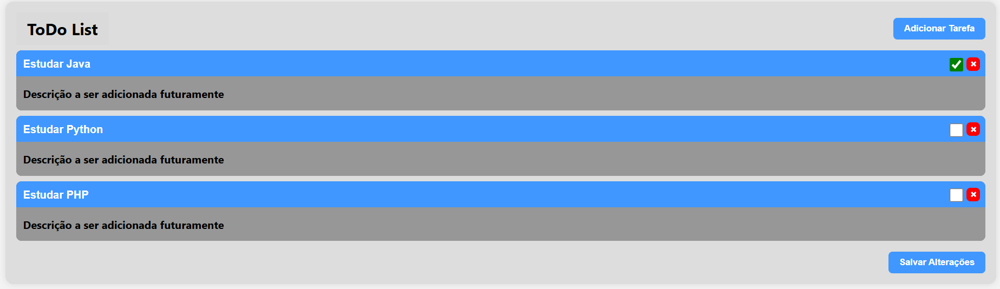
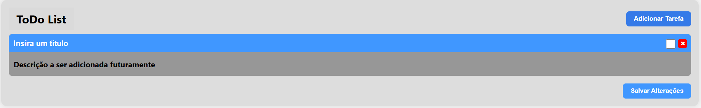
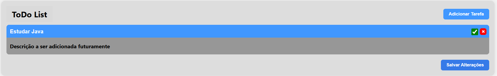
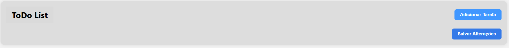

# TodoList Frontend

## O projeto 📊
Este é o frontend para uma aplicação de gerenciamento de tarefas

## Tecnologias Utilizadas 🧭
- **React** - Biblioteca principal
- **TypeScript** - Para tipagem estática
- **Axios** - Para requisições HTTP
- **Vite** - Para bundling e desenvolvimento
- **Figma** - Para design da interface

## Pré-requisitos
- Node.js 18 ou superior
- Backend Spring Boot disponível na porta 8080

## Backend 🌐
O frontend se conecta a uma API em Spring Boot hospedada em: http://localhost:8080/api/v1/tasks

## Como executar o projeto ⚙️
Clone o repositório:

```bash
git clone https://github.com/guibarbian/TodoListFrontend.git
cd TodoListFrontend
```

Instale as dependências:
```bash
npm install
```

Execute o servidor de desenvolvimento:
```bash
npm run dev
```

Acesse no navegador: http://localhost:5173

Nota: Certifique-se de que a API backend esteja rodando corretamente em http://localhost:8080.

## Estrutura do Projeto 📁

```bash
├── src
│   ├── components
│   │   └── TaskItem.tsx
│   ├── pages
│   │   └── Home.tsx
│   ├── services
│   │   └── api.ts
│   ├── types
│   │   └── Task.ts
│   ├── App.tsx
│   ├── main.tsx
├── public
├── package.json
└── vite.config.ts
```

## Funcionalidade do Projeto 📷
### Get
Ao abrir a aplicação, a primeira requisição a ser feita será um `GET` de tasks, assim mostrando 
todas as Tasks que existem no banco


### Post
Para fazer um `POST` de uma Task, basta clicar no botão "Adicionar Tarefa", que será criada uma 
nova tarefa no board com um "título" padrão e "concluida" como `false`.


### Put
Para fazer um `PUT` de uma task, basta fazer as alterações planejadas e clicar em "Salvar 
Alterações", assim, a aplicação vai atualizar os dados da Task no banco de dados


### Delete
Por fim, para fazer um `DELETE` de uma Task, basta clicar no botão com `X` ao lado do check de
conclusão da task, assim, ela será permanentemente deletada do banco de dados


## Desenvolvido com ⚙ 
- VSCode

## Autor ✏
- Guilherme A. Barbian